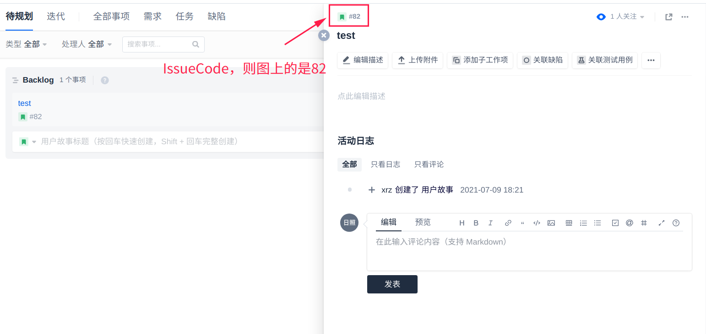
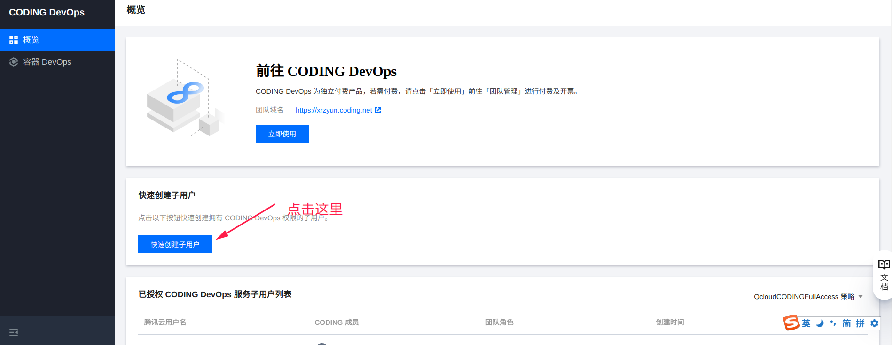
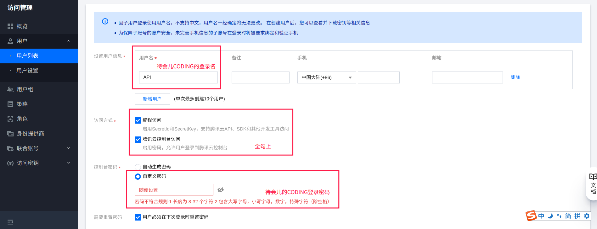
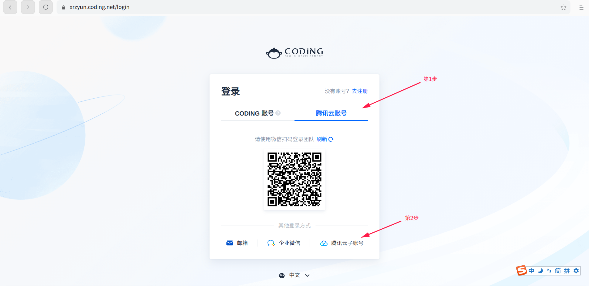
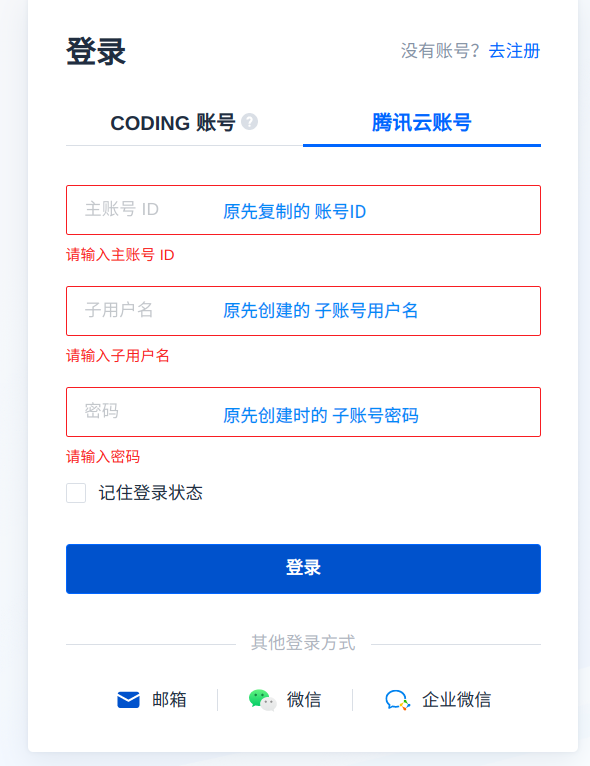
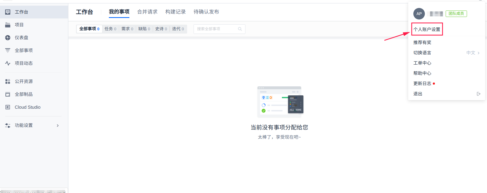
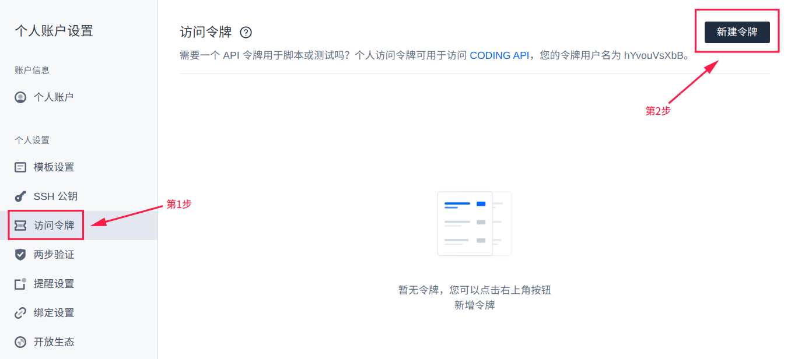

# coding-list

## 镜像
[GitHub](https://github.com/xrz-cloud/coding-list)(推荐)  
[Gitee](https://gitee.com/xrz-cloud/coding-list)  
[CODING](https://xrzyun.coding.net/public/xrz-video/coding-list/git/files)  

## 目录

[前言](#前言)  
[安装](#安装)  
[选项及配置](#选项及配置)  

## 前言

本分享程序文件储存于[CODING](//coding.net)提供的腾讯云COS对象存储,稳定性有保障(bushi  
本程序参(piao)考(qie)于[此网站](//od-api.vercel.app),其原本是OneDrive目录分享程序,反正就是我对其HTML和JS魔改得到的。  

示范站:[XRZ's CODING-LIST](//api.xrzyun.top/coding/list)  

样式来自[onedrive-cf-index](https://github.com/spencerwooo/onedrive-cf-index),写API的灵感来自[sosf](https://github.com/beetcb/sosf).程序部署在[Vercel](https://vercel.com)上,免费的API请求量够用，详情请看[官方文档](https://vercel.com/pricing)。  

将白嫖发挥至极致，本程序运行不花1分钱，把提供文件存储的CODING作为后台，尽量减少账号注册量。

## 安装

演示环境为Linux-Deepin

#### 1.克隆本储存库

```bash
git clone https://github.com/xrz-cloud/coding-list
```

镜像源：`git clone https://e.coding.net/xrzyun/xrz-video/coding-list.git`  

#### 2.配置参数

1. 创建项目
新建一个项目，启用 项目协同。
随便创建一个事项，记下其`IssueCode`，图上的`IssueCode`是`82`。  

接下来你可以上传附件或新建子工作项以便之后测试。  

2. 获取CODING令牌  
进入你的CODING团队`{你的团队域名}.coding.net`。

> 点击右上角的【个人设置】>【访问令牌】>【新建令牌】，勾选相关权限后会生成「个人访问令牌」。若刷新页面令牌会消失，需输入账号密码后重新生成。  

这里建议开一个新用户，以保证子账号权限泄露后不会被滥用，影响其他数据，不在意的话，请跳过。

<details>
<summary><strong>开新用户方法</strong>(点击这段文字展开)</summary>

点击右上角的【团队管理】>【成员管理】>【齿轮图标】>【新建子用户】  
  
跳转至腾讯云，用 [CODING]/[原先绑定CODING的腾讯云] 的账号密码登录。  
【快速创建子用户】  
  
再打开的界面中按引导设置,创建子用户。  
  
打开[腾讯云账号](https://console.cloud.tencent.com/developer),【基本信息】>【账号ID】,复制`账号ID`。  
浏览器 隐私模式/[InPrivate浏览](https://baike.baidu.com/item/InPrivate%E6%B5%8F%E8%A7%88/5727666) ，打开`https://{你的团队域名}.coding.net/login`  
用子账号登录，【腾讯云账号】>【腾讯云子账号】，按创建时信息填写。  
  

用管理员账号在团队设置中为子账号新建一个权限组，在项目设置中新建用户组，设置子中权限，保证能访问issue即可。
</details>

<---分割线---**请看一下上一排文字**---分割线--->
<这里开始不是 “开新用户方法” 了>  
点击右上角的【个人设置】>【访问令牌】>【新建令牌】。  
  
  
建议勾选`project:file`,`project:issue`以保证以后继续可用，但现在全不勾选的权限也够用了（玄学，所以这里的精细权限设置只能靠新建子用户了）。  
复制新建的令牌。  

3.修改配置文件  
打开克隆下来的文件夹，找到`api/api.js`,在第2行`token`后填写刚才新建的令牌。  
找到`web/js/coding-list-app.js`，在第15行`coding_hostname`后填写你的CODING团队域名；在第16行`title`后填写你想要的网站标题；  
第23到50行是网站首页配置， 其中第29行`Description`是页面上下的文字，详细配置见[描述](#描述)；31行起的`SubTasks`是子项目，可视为文件夹，`Code`请填想要引导至的IssueCode，`Name`请填想要的文件夹名。  

#### Vercel上传

请提前注册[Vercel](https://vercel.com)账号。  
Vercel的命令行工具是使用 Node.js 编写的，因此使用 npm 安装，也因此同时支持 Windows、macOS 和 Linux 操作系统。如果你没有安装过 Node.js 环境，需要先安装 Node.js。之后，可以在 Windows 的 Powershell 或者 macOS 的终端中运行下述命令安装 Vercel：

```bash
npm i -g vercel
```

命令行登录：

```bash
vc login
```

现在，你可以通过`vc dev`来本地测试，或`vc`来初始化。接下来会有一段交互。  

```bash
Vercel CLI 23.0.1 dev (beta) — https://vercel.com/feedback
? Set up and develop “~/xrz/coding-list”? [Y/n] y
? Which scope should contain your project? xrz
? Link to existing project? [y/N] n
? What’s your project’s name? coding-list
? In which directory is your code located? ./
No framework detected. Default Project Settings:
- Build Command: `npm run vercel-build` or `npm run build`
- Output Directory: `public` if it exists, or `.`
- Development Command: None
? Want to override the settings? [y/N] n
```

貌似一路回车，默认配置即可。  
若无问题，即可输入`vc --prod`来上传并在公网访问。  
更多细节配置，在 https://vercel.com/dashboard `coding-list`中配置，也可以善用搜索引擎，自己搜索优化。  

## 选项及配置

### 导航

- [INDEX首页加载项](#INDEX首页加载项)
  - [描述](#描述)
- [美化项](#美化项)
  - [进度条颜色](#进度条颜色)
- [CODING后台项](#CODING后台项)
  - [修改描述](#修改描述)
  - [附件](#附件)
  - [子工作项](#子工作项)

### INDEX首页加载项

#### 描述

描述可以识别JSON或文本，若直接输入文本，则在顶部显示此文本，与

```json
{"textarea":{"top":"${你输入的文本}","bottom":""}}
```

这段JSON等价。  
描述支持HTML标签，可以直接输入，也可通过插入JSON来自定义。  

范例描述：  

```json
{\"textarea\":{\"top\":\"欢迎访问CODING-LIST文件分享！<br>本分享程序文件储存于CODING提供的腾讯云COS对象存储。<br>稳定性有保障(bushi\",\"bottom\":\"本程序开源于GitHub <a href='//github.com/xrz-cloud/coding-list' target='_blank'>跳转</a>\"}}
```

意思是，在顶部显示
>欢迎访问CODING-LIST文件分享！<br>本分享程序文件储存于CODING提供的腾讯云COS对象存储。<br>稳定性有保障(bushi

```html
欢迎访问CODING-LIST文件分享！<br>本分享程序文件储存于CODING提供的腾讯云COS对象存储。<br>稳定性有保障(bushi
```

在底部显示
>本程序开源于GitHub <a href='//github.com/xrz-cloud/coding-list' target='_blank'>跳转</a>

```html
本程序开源于GitHub <a href='//github.com/xrz-cloud/coding-list' target='_blank'>跳转</a>
```

##### 注意事项1

`"Description"`后面是**双引号包裹**的经过**转义**的JSON，编辑完JSON后，记得要转义，这里提供[一个转义网站](//www.bejson.com/)。  

#### 以CODING事项作为首页

打开`web/js/coding-list-app.js`，找到第438行，修改`"/"`为`"?code=把我改为一个IssueCode"`。  
原文件：  

```js
if (code == 0) window.location = "/"
```

修改范例：

```js
if (code == 0) window.location = "?code=81"
```

### 美化项

#### 进度条颜色

打开`web/js/coding-list-app.js`，找到第10行，修改

```js
const theme = "#a685e2"
```

把16进制颜色`#a685e2`改为你想要的。  

### CODING后台项

#### 修改描述

参考 [选项/INDEX首页加载项/描述](#描述)。

##### 注意事项2

CODING后台中，若要使用JSON配置，请不要转义，否则可能会导致显示出错。  

#### 附件

随便上传附件吧，本程序的核心在此，因为附件上传没有限制，反正我传了约100GB的视频，现在没有翻车。不过还是节制一点，以免又少了一个免费文件分享的渠道。  

#### 子工作项

文件夹功能就是靠此实现的，你可以在子工作项中上传附件，即在子文件夹中浏览文件。  

## 信息

本程序以[MIT](LICENSE)协议开源。  
提意见可以开Issue，或发邮件至`admin@xrzyun.top`。  
欢迎提交PR。  
